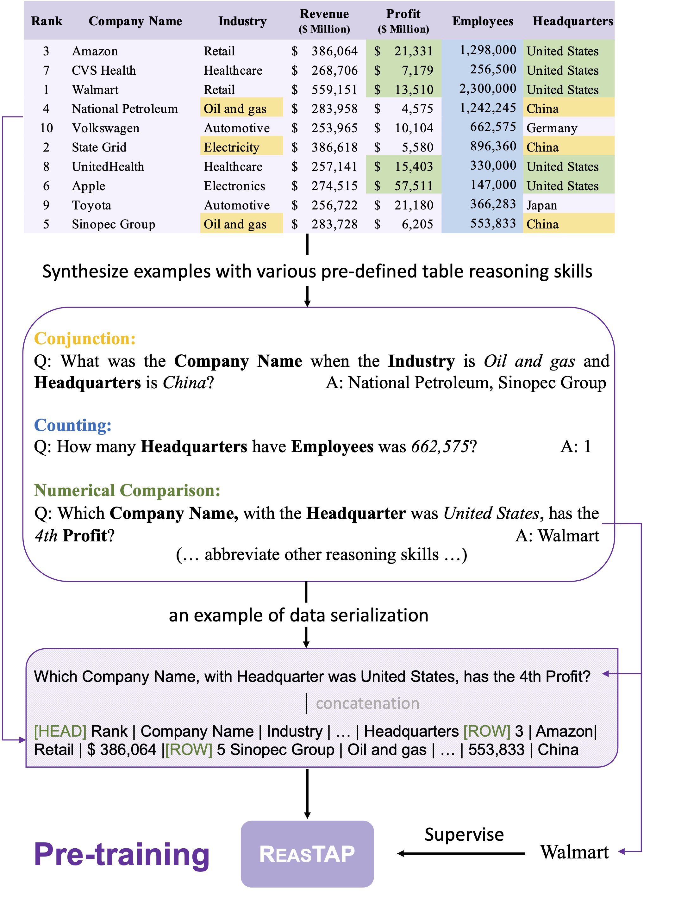

# ReasTAP
The code for EMNLP 2022 paper [ReasTAP: Injecting Table Reasoning Skills During Pre-training via Synthetic Reasoning Examples](https://aclanthology.org/2022.emnlp-main.615.pdf).
<p align="center">

</p>

## Prepare Environment
We officially support python 3.9. You could use following commands to install the required packages
```
pip install -r requirements.txt
```

## Synthetic Table QA Generation

We provide details of the synthetic table QA generation pipeline in the `README.md` file located in the `synthetic_tableqa_generation` folder, along with the pretraining data and intermediate files shared on [Google Drive](https://drive.google.com/drive/folders/1YRmRibz_fVZbrb2W1ynFWS6h-uwJw0oN?usp=sharing).

### Pretraining Data Format
Each example contains 3 fields `source`, `reasoning_type`, `question`, `table` and `answers`, where
- `source` indicates whether the example is from the synthetic table QA generation pipeline or the SQL execution data generation pipeline (from tapex).
- `reasoning_type` indicates the type of table reasoning skills required to answer the question, if the example is from the synthetic table QA generation pipeline.
- `table` is a 2-dimensional table with a `header` and one or multiple `rows`.
- `question` is the natural language question or SQL query.
- `answers` is a list of answers or executed results.

## Experiments

### Model list
We have released following models in [Huggingface Hub](https://huggingface.co/Yale-LILY).
- Pretrained models
  - [Yale-LILY/reastap-large](https://huggingface.co/Yale-LILY/reastap-large): Pretrained on synthetic table qa and SQL execution data.
- Finetuned models
  - Table Question Answering
    - [Yale-LILY/reastap-large-finetuned-wtq](https://huggingface.co/Yale-LILY/reastap-large-finetuned-wtq): `Yale-LILY/reastap-large` finetuned on the [WikiTableQuestions](https://huggingface.co/datasets/wikitablequestions) dataset.
    - [Yale-LILY/reastap-large-finetuned-wikisql](https://huggingface.co/Yale-LILY/reastap-large-finetuned-wikisql): `Yale-LILY/reastap-large` finetuned on the [WikiSQL](https://huggingface.co/datasets/wikisql) dataset.
  - Table Fact Checking
    - [Yale-LILY/reastap-large-finetuned-tabfact](https://huggingface.co/Yale-LILY/reastap-large-finetuned-tabfact): `Yale-LILY/reastap-large` finetuned on the [TabFact](https://huggingface.co/datasets/tab_fact) dataset.
  - Table-to-Text Generation
    - [Yale-LILY/reastap-large-finetuned-logicnlg](https://huggingface.co/Yale-LILY/reastap-large-finetuned-logicnlg): `Yale-LILY/reastap-large` finetuned on the [LogicNLG](https://huggingface.co/datasets/kasnerz/logicnlg) dataset.

We have prepared bash scripts for both pretraining and finetuning in the `bash_scripts` folder. Please ensure that you adjust and set `CUDA_VISIBLE_DEVICES` and batch size accordingly in each bash script. The current setting works for an 8x A6000-48G cluster with 1024G memory.

### Pretraining Experiments
```
bash bash_scripts/train_scripts/pretrain.sh
```

### Fintuning Experiments
**Training**
```
bash_scripts/train_scripts/train_*.sh
```
**Evaluation**
```
bash_scripts/evaluation_scripts/eval_*.sh
```

**Inference**
```
bash_scripts/prediction_scripts/predict_*.sh
```
The prediction files in json format will be stored in the `outputs/*/` folder. To evaluate performance on the LogicNLG dataset, please use the evaluation scripts in their official [LogicNLG github repo](https://github.com/wenhuchen/LogicNLG).

## Results
To facilitate the reproducibility of our results by other researchers, we have rewritten the model code using the `transformers` library because it enables us to directly share the model weights on Huggingface Hub. However, due to this change, there might be slight differences in the results compared to the original paper, which employed the `fairseq` library. The updated results are as follows:

| Task | Dev Accuracy | Test Accuracy |
|:---:|:---:|:---:|
| **WikiSQL** | 89.6 | 89.2 |
| **WikiTableQuestion** | 59.7 | 58.7 |
| **TabFact** | 84.6 | 84.9 |

| | | BLEU-1/2/3 | SP-Acc | NLI-Acc | | BLEU-1/2/3 | SP-Acc | NLI-Acc |
|:---:|:---:|:---:|:---:| :---:|:---:|:---:|:---:|:---:|
| **LogicNLG**| *Dev* | 53.3/33.6/20.0 | 54.8 | 90.1 | *Test* | 53.7/34.3/20.7 | 54.4 | 89.3 |


The output files are stored in `outputs` folder. 

## Contact
For any issues or questions, kindly email us at: Yilun Zhao (yilun.zhao@yale.edu).

## Citation
```
@inproceedings{zhao-etal-2022-reastap,
    title = "{R}eas{TAP}: Injecting Table Reasoning Skills During Pre-training via Synthetic Reasoning Examples",
    author = "Zhao, Yilun  and
      Nan, Linyong  and
      Qi, Zhenting  and
      Zhang, Rui  and
      Radev, Dragomir",
    booktitle = "Proceedings of the 2022 Conference on Empirical Methods in Natural Language Processing",
    month = dec,
    year = "2022",
    address = "Abu Dhabi, United Arab Emirates",
    publisher = "Association for Computational Linguistics",
    url = "https://aclanthology.org/2022.emnlp-main.615",
    pages = "9006--9018",
}
```